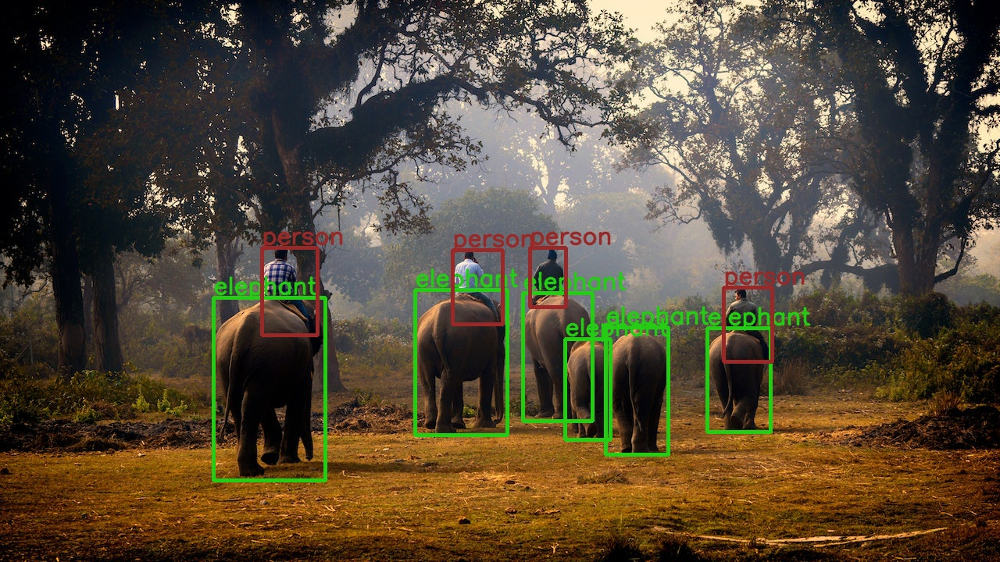

# 🎯 Object Detection with PyTorch & Flask


A complete end-to-end object detection system that leverages **PyTorch's Faster R-CNN** pretrained model and serves detection via a **Flask web application** and REST API. This project supports detecting objects in images and videos using a modular and extensible pipeline.

## 📸 Demo


## 🚀 Features

- 🔍 Object detection using Faster R-CNN ResNet50 FPN V2 with COCO weights
- 🖼️ Detect objects in images with bounding box visualization
- 🎥 Detect objects frame-by-frame in videos with FPS display
- 🌐 Web interface for easy image input and result visualization
- ⚙️ REST API backend for programmatic detection requests
- 💻 Modular Python scripts for model loading, inference, and visualization
- 🗂️ Organized project structure for ease of use and extension

## 📁 Project Structure

```bash
Object-Detection-With-PyTorch-and-Custom-the-Model-By-Flask
├── assets/                  # Static assets for UI or documentation
├── data/                    # Dataset files (annotations, images)
├── docs/                    # Documentation resources
├── input/                   # Input images/videos for testing
├── outputs/                 # Output detections and results
├── python/                  # Core Python modules
│   ├── detect_utils.py      # predict() + draw_boxes()
│   ├── model.py             # Load pretrained Faster R-CNN model
│   └── utils.py             # COCO class names
├── static/                  # Static files served by Flask
│   ├── css/                 # CSS styles
│   │   └── main.css         # Stylesheet for the web UI
│   └── uploads/             # Uploaded images directory
├── templates/               # HTML templates for Flask web pages
│   ├── base.html            # HTML base layout
│   └── homepage.html        # Home page with upload and detection UI
├── translations/            # Language translations (if applicable)
├── api_app.py               # Flask app and routes
├── detect_api.py            # Core detection for Flask app
├── detect_image.py          # CLI: detect objects in image
├── detect_video.py          # CLI: detect objects in video
├── LICENSE                  # License file (MIT)
├── README.md                # This README file
└── requirements.txt         # Python dependencies
```

## 💡 Installation

1. Clone the repository:

```bash
git clone https://github.com/TareqAlKushari/Object-Detection-With-PyTorch-and-Custom-the-Model-By-Flask.git
cd Object-Detection-With-PyTorch-and-Custom-the-Model-By-Flask
```

2. (Optional) Create and activate a virtual environment:

```bash
python -m venv venv
source venv/bin/activate  # On Windows: venv\Scripts\activate
```

3. Install required packages:

```bash
pip install -r requirements.txt
```

## 🎯 Usage

### Image Detection

Detect objects on a single image and save the output with bounding boxes.

```bash
python detect_image.py path/to/image.jpg --threshold 0.5
```

The output image will be saved in `outputs/` directory.

### Video Detection

Detect objects on a video file (or webcam stream) frame-by-frame with FPS display.

```bash
python detect_video.py path/to/video.mp4 --threshold 0.5
```

Processed video will be saved in `outputs/` directory.

Press `q` to quit the video window early.

### Flask Web Application

Start the interactive web app to upload images and visualize detection results in the browser.

```bash
python api_app.py
```

Open [http://localhost:9000](http://localhost:9000) in your browser.

* Input the path to an image accessible to the server for detection.
* View the annotated image rendered in the web page.

### REST API Integration

Use `detect_api.py` functions to integrate detection into other applications or create REST endpoints.

Example `curl` request (assuming you add an API endpoint):

```bash
curl -X POST -F image=@path/to/image.jpg http://localhost:5000/predict
```

## 🧠 How It Works

### 🔍 Backend Inference Flow

* `python/model.py`: Loads pretrained model from `torchvision.models.detection`
* `detect_utils.py`:

  * `predict(image, model, device, threshold)` – preprocesses image, runs inference, filters predictions
  * `draw_boxes()` – draws bounding boxes and class labels using OpenCV
* `utils.py`: Defines the 91 COCO classes used for label mapping

### 🎨 Web UI Logic

* HTML/CSS in `templates/` and `static/css/`
* Input form allows user to submit image path
* `api_app.py`:

  * Renders `homepage.html`
  * Calls `detect_api.py` to run detection on the input
  * Saves and displays output via HTML ``

## 🧾 COCO Classes (Examples)

* person, bicycle, car, motorcycle, airplane, bus
* dog, cat, horse, sheep, cow
* bottle, chair, laptop, keyboard, clock
* ... and more (total: 91 categories)

## 📷 Sample Output

|                 **Input**                 |               **Detected Output**               |
| :---------------------------------------: | :---------------------------------------------: |
|  |  |

## ⚙️ Dependencies

* Python 3.7+
* PyTorch
* torchvision
* OpenCV
* Flask
* Pillow
* numpy

(See `requirements.txt` for full list.)

## 📄 License

This project is licensed under the [MIT License](LICENSE).

## 👤 Author

**Tareq Al Kushari**
🔗 [GitHub Profile](https://github.com/TareqAlKushari)

---

If you encounter any issues or have suggestions, please open an issue or submit a pull request.
Happy detecting! 🚀
